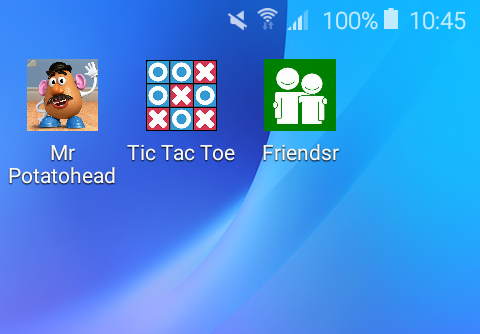

# Friendsr

This is an app where you can rate your friends.

If you click on one friend. The screen will show an bigger picture of your friend, and a ratingbar under the picture. Plus information about your friend.
You can always set the ratingbar.

The pictogram of the app is like this:

